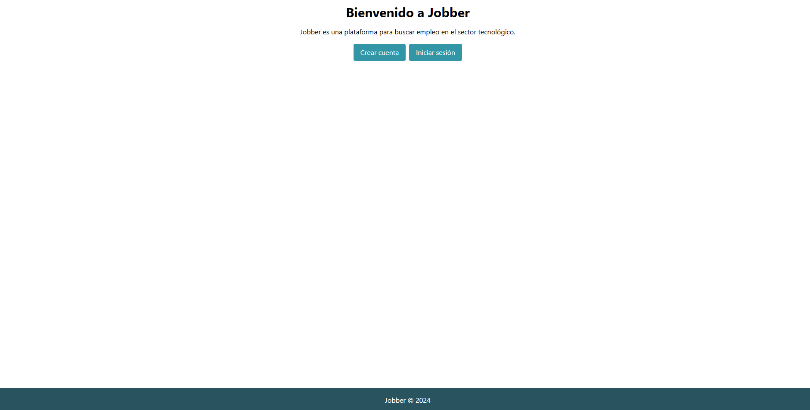
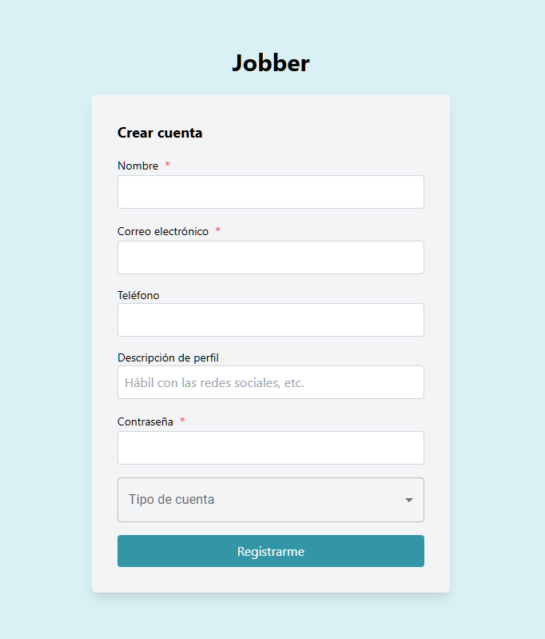
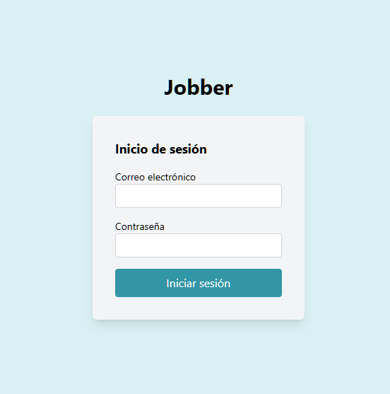
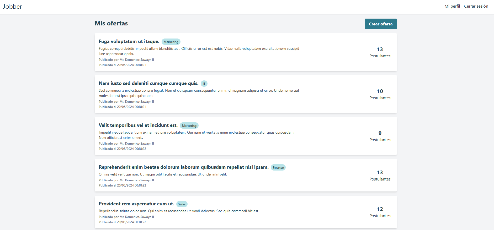
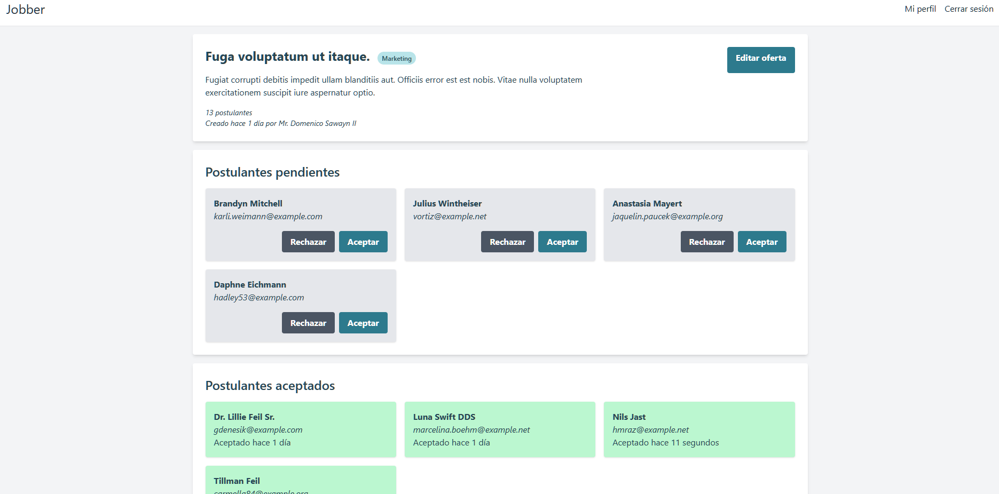

# Jobber

## Descripción

Jobber es un sistema que permite publicar ofertas de trabajo y a usuarios postularse a ellas.
El backend está desarrollado en PHP con Laravel y el frontend en React. Toda la interacción entre el frontend y el backend se realiza a través de una API REST.

### Endpoints de la API

-   `GET /api/test`: Endpoint de prueba que devuelve un mensaje de éxito.
-   `POST /api/login`: Endpoint para iniciar sesión. Recibe un email y una contraseña y devuelve un token de autenticación.
-   `POST /api/register`: Endpoint para registrar un nuevo usuario. Recibe un email y una contraseña y devuelve un token de autenticación.
-   `GET /api/me`: Endpoint para obtener los datos del usuario autenticado.
-   `PUT /api/me`: Endpoint para actualizar los datos del usuario autenticado.
-   `PUT /api/me/password`: Endpoint para actualizar la contraseña del usuario autenticado.

-   `GET /api/offers`: Endpoint para obtener todas las ofertas de trabajo.
-   `POST /api/my_offers`: Endpoint para obtener las ofertas de trabajo creadas por el usuario autenticado.
-   `POST /api/offers`: Endpoint para crear una nueva oferta de trabajo.
-   `GET /api/offers/{id}`: Endpoint para obtener una oferta de trabajo por su ID.
-   `PUT /api/offers/{id}`: Endpoint para actualizar una oferta de trabajo por su ID.
-   `DELETE /api/offers/{id}`: Endpoint para eliminar una oferta de trabajo por su ID.

-   `POST /api/applications/{id}/accept`: Endpoint para aceptar una postulación por su ID.
-   `POST /api/applications/{id}/reject`: Endpoint para rechazar una postulación por su ID.

-   `POST /api/offers/{id}/apply`: Endpoint para postularse a una oferta de trabajo.

-   `GET /api/applications`: Endpoint para obtener todas las postulaciones del usuario autenticado.
-   `GET /api/applications/{id}`: Endpoint para obtener una postulación por su ID.
-   `DELETE /api/applications/{id}`: Endpoint para eliminar una postulación por su ID.

## Instalación

### Pre-requisitos

-   Node.js
-   npm
-   php
-   mysql (o cualquier otro motor de base de datos)
-   Composer

### Instalación

1. Clonar el repositorio
1. Instalar las dependencias con `npm install`
1. Instalar las dependencias de PHP con `composer install`
1. Crear un archivo `.env` en la raíz del proyecto con la configuración de la base de datos. Puede copiar el archivo `.env.example` y modificarlo.
1. Crear la base de datos con `php artisan migrate`
1. Hacer un build de react con `npm run build`
1. Iniciar el servidor con `php artisan serve`
1. Acceder a `http://localhost:8000` desde un navegador

## Uso

Para poder utilizar el sistema es necesario registrarse como postulante o como reclutador. Una vez registrado, se puede iniciar sesión y acceder a las ofertas de trabajo disponibles. Los reclutadores pueden crear nuevas ofertas de trabajo y los postulantes pueden postularse a ellas.

### Vistas

A continuación se presentan algunas capturas de pantalla de las vistas del sistema.

Lading Page

Formulario de registro

Formulario de inicio de sesión

Dashboard de reclutador

Oferta de trabajo vista por reclutador

## Pruebas

Para ejecutar las pruebas de PHP se puede utilizar el comando `php artisan test`. Si por alguna razón no funciona, limpia la caché de Laravel con `php artisan optimize` y vuelve a intentar.

Para ejecutar las pruebas de React se puede utilizar el comando `npm run test`. Esto ejecutará vitest y aplicará las pruebas.

### Pruebas de vitest

Estas pruebas se pueden encontrar en el directorio `tests\components`, los casos probados fue el de Login, Dashboard, CreateOffer, OfferCard y Title.

Estas pruebas verifican que:

-   Los datos se recuperan y muestran correctamente en el dashboard. (Dashboard.test.tsx)

-   Que los datos se envían correctamente al servicio web desde el formulario. (CreateOffer.test.tsx)

-   Que un componente clave se renderiza correctamente con los datos esperados. (OfferCard.test.tsx)

-   Para simular un evento de usuario y verificar que se maneje correctamente. (Login.test.tsx)

## Despliegue en Vercel

El despliegue en Vercel se encuentra en la siguiente URL:
